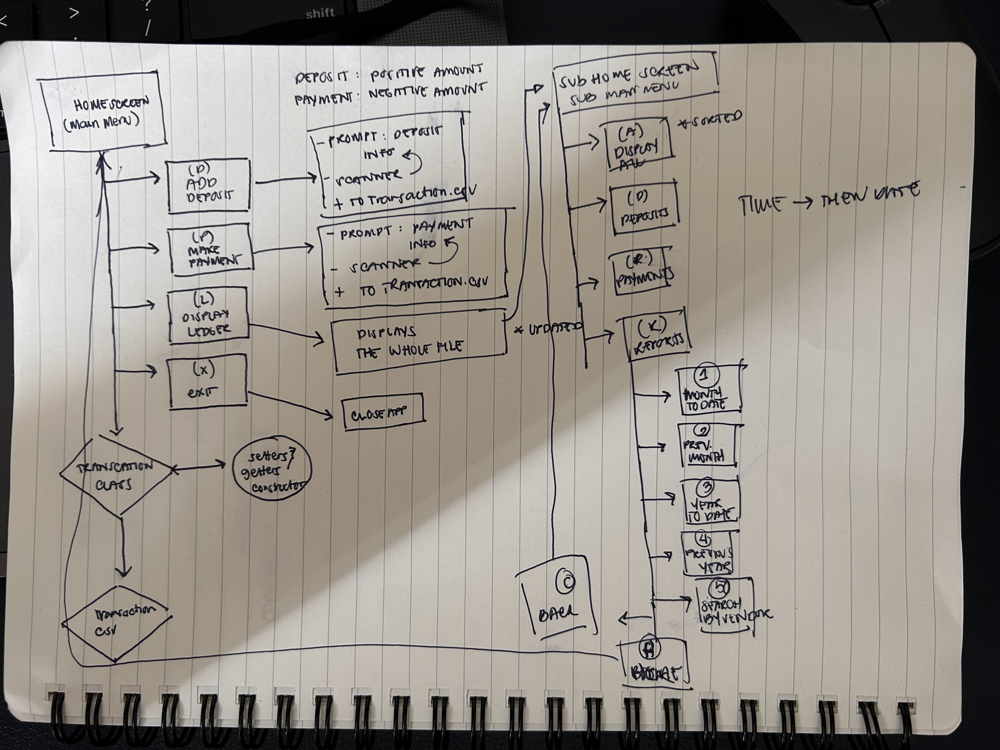

# ❚█══█❚ Gainful Ledger: Gym Financial Transaction Application

A console based Java Application for tracking gym-related financial transactions such as deposit and payments with a fully themed ledger, custom rpeorts, and ASCII art UI built for  iron-minded bookkeeper. ( ◡̀_◡́)ᕤ

---
## Table Of Contents

- [Overview](#Overview)
- [Feature](#Feature)
- [Project Structure](#preject-structure)
- [Getting Started](#getting-started)
- [How to Use](#how-to-use)
- [Data Format](#data-format)
- [Error Handling](#error-handling)
- [Technologies Used](#Overview)

---
## Overview
**Gainful Ledger** is a Java CLI application that allows users to track deposits and payments, view a complete transaction history, and generate custom reports by date or vendor. The experience is enhanced with a fun gym-themed interface, featuring ASCII art menus and motivational messages.

**Add something about how the process was for you 1. image
---

## Features

| **Adding Deposit And Payment Transactions** 	| Description prompts the user and collects all required transaction data via scanner inputs. Appends a new pipe-delimited transaction row to the file using  FileWriter and BufferedWriter without overwriting existing data. Filters the transaction type by taking in a transactionType String parameter to validate the entered amount. 	|
|---------------------------------------------	|-------------------------------------------------------------------------------------------------------------------------------------------------------------------------------------------------------------------------------------------------------------------------------------------------------------------------------------------	|
| **Full Ledger View**                        	| View all transactions sorted by date and time (newest first)                                                                                                                                                                                                                                                                              	|
| **Filter by Type**                          	| View only deposits or only payments                                                                                                                                                                                                                                                                                                       	|
| **Custom Date Reports**                     	| The custom reports include Month to Date, Previous Month, Year to Date, and Previous Year.                                                                                                                                                                                                                                                	|
| **Search by Vendor**                        	| Find all transactions by a specific vendor name                                                                                                                                                                                                                                                                                           	|
| **File Storage**                            	| All transactions are saved to a CSV file and loaded on startup                                                                                                                                                                                                                                                                            	|
| **Input Validation**                        	| Enforces positive amounts for deposits and negative for payments                                                                                                                                                                                                                                                                          	|

---
## Project Structure

Before jumping on my laptop and writing any code, I took some time to really understand the flow of the project. As a visual learner, it helps me to map everything out first — so I grabbed a piece of paper and sketched out some flowcharts the old fashioned way!



P.S Not the best handwriting, but this is how it all started...

**The Project Tree**

Nothing too complicated here, just a clean setup to keep things organized.
```
src/
└── main/
    ├── java/
    │   └── com/pluralsight/
    │       ├── Main.java          # Application entry point & all menu logic
    │       └── Transaction.java   # Transaction data model
    └── resources/
        └── transactions.csv       # transaction storage
```
