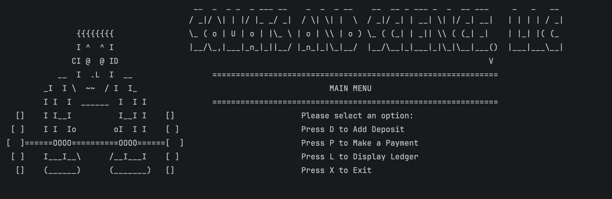
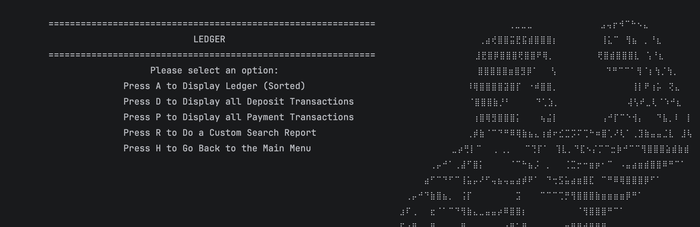
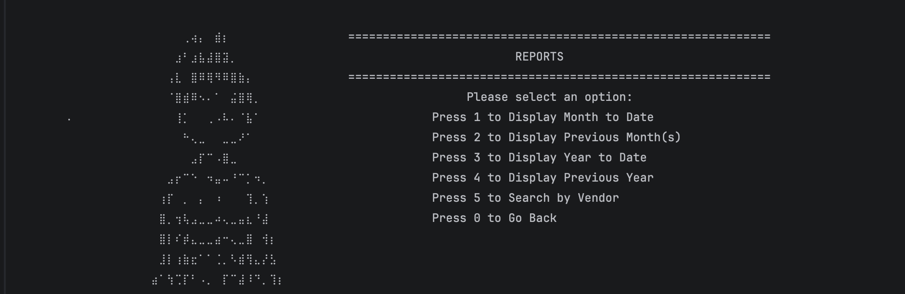
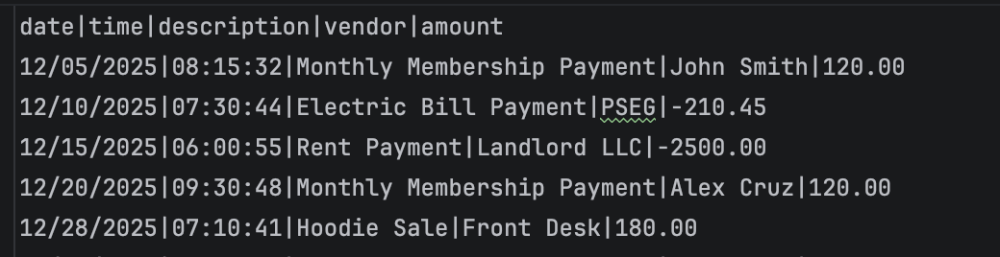

# ❚█══█❚ Gainful Ledger: Gym Financial Transaction Application

A console based Java Application for tracking gym-related financial transactions such as deposit and payments with a fully themed ledger, custom rpeorts, and ASCII art UI built for  iron-minded bookkeeper. ( ◡̀_◡́)ᕤ

---
## Table Of Contents

- [Overview](#Overview)
- [Biggest Challenge](#biggest-challenge)
- [Features](#Features)
- [Project Structure](#project-structure)
- [How to Use](#how-to-use)
- [Data Format](#data-format)
- [Error Handling](#error-handling)
- [Technologies Used](#technologies-used)

---
## Overview
**Gainful Ledger** is a Java CLI application that allows users to track deposits and payments, view a complete transaction history, and generate custom reports by date or vendor. The experience is enhanced with a fun gym-themed interface, featuring ASCII art menus and motivational messages.

---
## Biggest Challenge

One of the biggest challenges I faced was keeping the code condensed. My goal was to create reusable, simple methods and I'm proud to say I pulled it off! A great example of this is under the Custom Reports Menu: MTD, YTD, Previous Month, and Previous Year. Initially I had each report as its own separate method, but then I realized the logic behind each one was essentially the same, so I consolidated them all into one.  thought I could take advantage of date ranges, so I made good use of LocalDate and LocalTime to make that happen.

**The method call:**
```
displayTransactions(LocalDate start, LocalDate end, String type)
```


---

## Features
| **Adding Deposit And Payment Transactions** 	| Description prompts the user and collects all required transaction data via scanner inputs. Appends a new pipe-delimited transaction row to the file using  FileWriter and BufferedWriter without overwriting existing data. Filters the transaction type by taking in a transactionType String parameter to validate the entered amount. 	|
|---------------------------------------------	|-------------------------------------------------------------------------------------------------------------------------------------------------------------------------------------------------------------------------------------------------------------------------------------------------------------------------------------------	|
| **Full Ledger View**                        	| View all transactions sorted by date and time (newest first)                                                                                                                                                                                                                                                                              	|
| **Filter by Type**                          	| View only deposits or only payments                                                                                                                                                                                                                                                                                                       	|
| **Custom Date Reports**                     	| The custom reports include Month to Date, Previous Month, Year to Date, and Previous Year.                                                                                                                                                                                                                                                	|
| **Search by Vendor**                        	| Find all transactions by a specific vendor name                                                                                                                                                                                                                                                                                           	|
| **File Storage**                            	| All transactions are saved to a CSV file and loaded on startup                                                                                                                                                                                                                                                                            	|
| **Input Validation**                        	| Enforces positive amounts for deposits and negative for payments                                                                                        |

---
## Project Structure

Before jumping on my laptop and writing any code, I took some time to really understand the flow of the project. As a visual learner, it helps me to map everything out first — so I grabbed a piece of paper and sketched out some flowcharts the old fashioned way!


*P.S Not the best handwriting, but this is how it all started...*

### Running the App

1. Clone or download the project
2. Make sure `src/main/resources/transactions.csv` exists with a header row:
   ```
   date|time|description|vendor|amount
   ```
3. Compile and run `Main.java`:
   ```bash
   javac src/main/java/com/pluralsight/Main.java
   java com.pluralsight.SquatsAndScienceSales
   ```
   Or run via your IDE (IntelliJ, Eclipse, etc.)
 ---
## How to use the application:

### _Main Menu_


```
D  →  Add a Deposit
P  →  Make a Payment
L  →  Open the Ledger
X  →  Exit
```
### _Ledger Menu_


```
A  →  Display All Transactions (sorted newest first)
D  →  Display Deposits Only
P  →  Display Payments Only
R  →  Open Custom Reports
H  →  Go Back to Main Menu
```
### _Custom Reports Menu_



```
1  →  Month to Date
2  →  Previous Month
3  →  Year to Date
4  →  Previous Year
5  →  Search by Vendor
0  →  Go Back
```

When prompted, enter:

| Field       | Format         | Example              |
|-------------|----------------|----------------------|
| Date        | `MM/dd/yyyy`   | `04/29/2026`         |
| Time        | `HH:mm:ss`     | `14:35:00`           |
| Description | Free text      | `Monthly Membership` |
| Vendor      | Free text      | `Iron Planet Gym`    |
| Amount      | Decimal number | `59.99` or `-59.99`  |

**Deposits must be **positive**. Payments must be **negative**. The app will re-prompt if you enter the wrong sign.**

---

## Data Format

Transactions are stored in `transactions.csv` using pipe-delimited (`|`) values:



***The file is read on startup and appended to on every new transaction.***

---
## Error Handling

| Scenario                        | Response                                                    |
|---------------------------------|-------------------------------------------------------------|
| File not found                  | `"File not found. It ghosted harder than your gym motivation."` |
| I/O error                       | `"I/O error. Something broke under pressure—too many reps."` |
| Wrong deposit amount (negative) | Re-prompts: `"Invalid input! Deposit must be positive."`   |
| Wrong payment amount (positive) | Re-prompts: `"Invalid input! Payments must be negative."`  |
| No matching transactions        | `"No transactions this month—your ledger is lighter than your warm-up set."` |
| Invalid menu input              | `"Wrong key! That rep doesn't count."`                     |
 

---
## Technologies Used

- **Java 17+**
- `java.time` — `LocalDate`, `LocalTime`, `DateTimeFormatter`
- `java.io` — `BufferedReader`, `BufferedWriter`, `FileReader`, `FileWriter`
- `java.util` — `ArrayList`, `Comparator`, `Scanner`
---
## Author

Hi, I’m Pat Roque, an aspiring software developer passionate about learning and growing in the tech space. With a background in customer experience and leadership, I bring strong communication and problem-solving skills into my development journey. I’m currently focused on Java, building applications and expanding my knowledge of programming fundamentals.

Built with lots of brain cells and mooskels by a developer who takes both their gains and their bookkeeping seriously ᕙ(⇀‸↼‶)ᕗ


---

_Huge shoutout to my instructor David for teaching us Java in a fun way and making this happen. To many more capstones!!_

